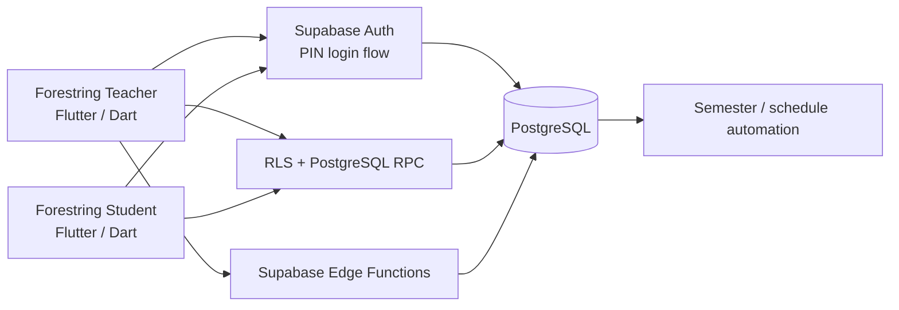

<p align="center">
  
</p>

<h1 align="center">Forestring Teacher</h1>

<p align="center">
  실제 바이올린 학원 운영을 위해 개발한 <b>Flutter + Supabase 기반 수업 운영·관리 앱</b>
</p>

<p align="center">
  <a href="https://github.com/B-Dandelion/forestring_stu">Student App</a>
  ·
  Current release: <code>v3.1.1</code>
</p>

---

## Overview

Forestring은 선생님과 수강생이 같은 수업 데이터를 기준으로 일정 조회, 취소, 보강, 학기 운영을 처리할 수 있도록 만든 학원 일정 관리 시스템입니다.

이 저장소는 그중 **Teacher / Manager / Master용 운영 앱과 Supabase 백엔드 정의**를 담고 있습니다. 기존 Firebase 기반 앱을 운영하면서 겪은 일정 데이터 정합성, 권한 분리, 수업 취소·보강 처리 문제를 개선하기 위해 Flutter 클라이언트와 PostgreSQL 중심 구조로 재설계했습니다.

### 사용자 역할

| Role | Scope |
| --- | --- |
| `teacher` | 본인 수업 및 담당 일정 조회 |
| `manager` | 담당 지점의 수업·수강생·선생님 관리 |
| `master` | 전체 지점과 운영 데이터 관리 |

## Key Features

- 월간 / 주간 수업 일정 조회
- 수업 1회 변경, 취소, 추가 수업 및 보강 등록
- 취소된 수업의 **수업권 반환 → 보강 사용** 흐름 관리
- 수강생 등록·수정·퇴원 및 담당 선생님 / 정규 일정 관리
- 선생님 등록, 근무시간, 계정 상태 및 PIN 관리
- 지점장 계정과 담당 지점 관리
- 지점 생성 및 운영 정보 관리
- 학기 / 휴원 기간 관리와 다음 학기 일정 준비
- 역할별 데이터 접근 범위 및 관리자 권한 분리

## Architecture



클라이언트에서는 화면과 상태 관리를 담당하고, 일정 변경처럼 정합성이 중요한 작업은 가능한 한 **RLS / RPC / Edge Function**을 통해 서버 측에서 검증하도록 구성했습니다.

## Engineering Highlights

### 1. Firebase → Supabase Migration

초기 Firebase / Firestore 기반 구현을 Supabase로 이전하면서 단순 SDK 교체가 아니라 데이터 구조와 권한 모델을 다시 설계했습니다.

- PostgreSQL 스키마 기반으로 수강생, 교사, 지점, 수업, 학기 데이터를 관계형 구조로 정리
- Flutter의 직접 DB 수정 범위를 줄이고 Repository 계층과 RPC 중심으로 변경
- Supabase migration 파일로 스키마 변경 이력을 관리
- Firebase 설정 및 직접 Firestore 의존성을 운영 코드에서 제거

### 2. Role-based Access Control

`teacher`, `manager`, `master`, `student` 역할별로 조회와 변경 가능 범위를 분리했습니다.

UI에서 메뉴를 숨기는 것에 그치지 않고, 데이터 접근은 **RLS와 서버 로직에서도 다시 검증**하도록 설계해 클라이언트 우회로 인한 잘못된 수정 가능성을 줄였습니다.

### 3. Lesson Right Lifecycle

수업 취소와 보강을 단순히 별도 일정으로 기록하지 않고, 사용할 수 있는 **수업권(lesson right / rebooking credit)**의 상태 변화로 연결했습니다.

```text
정규 수업 예약
    ↓ 취소
수업권 반환(available)
    ↓ 보강 예약
수업권 사용(consumed)
```

이를 통해 취소 수업과 보강 수업 사이의 연결 관계를 추적하고, 중복 사용이나 잘못된 보강 생성을 방지할 수 있도록 했습니다.

### 4. Semester & Academy Calendar

학기, 휴원 기간, 정규 수업 발생 시점을 별도의 운영 데이터로 관리합니다. 현재 학기와 다음 학기 데이터를 준비할 수 있도록 자동화 로직과 migration을 분리해 관리하고 있습니다.

### 5. Production-oriented Backend Structure

백엔드 관련 코드도 앱 저장소 안에서 함께 버전 관리합니다.

```text
supabase/
├── migrations/   # schema, RLS, RPC, scheduling changes
├── functions/    # PIN login / account management Edge Functions
└── tests/        # database-side verification
```

## Tech Stack

| Area | Stack |
| --- | --- |
| Mobile | Flutter, Dart |
| State Management | Provider |
| Backend | Supabase |
| Database | PostgreSQL |
| Auth / Security | Supabase Auth, RLS, RPC, Edge Functions |
| Scheduling UI | Syncfusion Flutter Calendar, TableCalendar |
| Deployment | Android, iOS |

## Project Structure

```text
lib/
├── app/
├── core/
├── features/
│   ├── auth/
│   ├── branches/
│   ├── lessons/
│   ├── managers/
│   ├── semesters/
│   ├── students/
│   └── teachers/
└── main.dart
```

기능별로 `data / domain / presentation` 영역을 나누고, UI에서 Supabase 호출을 직접 처리하지 않도록 Repository / Controller 계층을 두었습니다.

## Run Locally

운영 환경 값은 저장소에 포함하지 않습니다. `env/example.json`을 참고해 로컬 환경 파일을 구성한 뒤 실행합니다.

```bash
flutter pub get
flutter analyze
flutter run --dart-define-from-file=env/dev.json
```

릴리즈 빌드 예시:

```bash
flutter build appbundle --release --dart-define-from-file=env/dev.json
flutter build ipa --release --dart-define-from-file=env/dev.json
```

## Related Project

- [Forestring Student](https://github.com/B-Dandelion/forestring_stu) — 수강생용 일정 조회 / 취소 / 보강 예약 앱

## Notes

- 기본 브랜치 `main`은 현재 운영 기준 코드입니다.
- 과거 Firebase 구현과 주요 릴리즈 시점은 Git tag로 보존하고 있습니다.
- 실제 운영 계정, 개인정보, 비밀키 및 운영용 환경 값은 저장소에 포함하지 않습니다.
